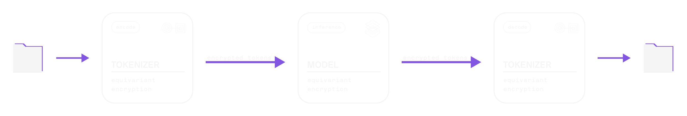

<!-- Logo with light mode support -->
<picture>
  <source media="(prefers-color-scheme: light)" srcset="Nesa_logo.png">
  
</picture>
 
 

Nesa: Run on-prem AI for a fraction of the cost in a blind API.

<h3 style="margin-top: 15px; margin-bottom: 15px; display: flex; justify-content: center; align-items: center; gap: 15px;">
  
  
</h3>

<!-- GitHub Repo Stats -->

<!---
---
-->

Forget multi-million dollar on-prem infrastructure, get the same privacy guarantees in a blind API - run AI like the biggest enterprises.

Nesa now supports major models, inference types, and RAG datastores with complete server-blindness.

# Features

## Blindness ##
Nesa serves requests with zero visibility on underlying data and full blindness on query. 

## Same Speed ##
Nesa delivers zero latency on blind inference.

## Wide Model Coverage ## 
Nesa has a wide range of model support, with coverage on 50,000+ models and multiple modalities.

## Cost Savings ##
vs Cloud AI: Nesa is ~80% cheaper*

vs On-prem AI: Nesa is ~99% cheaper*
*Considerations on cost savings rely on standard assumptions of GPU, infrastruture and basic staffing costs. Detailed cost comparison info can be found in our docs.

## RAG Support ##
Nesa supports integrating blind RAG datastores in-cloud.

## Easy Set-up ##
Nesa is one click install and go. See documentation.

## ChatGPT Compatible API ##
Nesa provides a ChatGPT-compatible API for running blind inference with a one-line change.

# How Nesa Achieves This

Equivariant Encryption (EE) is a new security technology by Nesa, similar to Homomorphic Encryption (HE) in arithmetic-based privacy-preserving structure, but executed inside unique discrete architectures that provide complete inference encryption with no additional latency. 

The result is a portable on-prem AI infrastructure solution inside an API. Your cloud provider cannot see your data and queries with Nesa.

# About Equivariant Encryption (EE)

At Nesa, privacy is a critical objective. On our path toward universal private AI, we confronted a key challenge: **how can we perform inference on neural networks without exposing the underlying input and output data to external parties while returning requests with no latency?** Traditional approaches, such as differential privacy, ZKML or homomorphic encryption (HE), while conceptually strong, fall short in practical deployments for complex neural architectures. These methods struggle to handle non-linear operations efficiently, often imposing substantial computational overhead that makes them infeasible to integrate into real-time or large-scale systems.

## Equivariant Encryption (EE) vs. Homomorphic Encryption (HE)

A snapshot of Equivariant Encryption's properties versus homomorphic encryption:

| **Feature** | **Equivariant Encryption (EE)** | **Homomorphic Encryption (HE)** |
| --- | --- | --- |
| Latency Overhead | Zero | Very High |
| Non-Linear Operations | Exact | Approximation Needed  |
| User Key Control | Direct & Custom | Schema-Defined  |
| Cryptographic Hardness | Massive Combinatorial Complexity | Standard Hardness Assumptions |

**Zero overhead:** Nesa EE provides the same latency as plaintext inference, with no slowdowns.

**128k factorial:** Nesa EE has a massive combinatorial complexity, contributing to the strongest security guarantees.

## Our Journey to Equivariant Encryption

We have implemented and investigated numerous methodologies that promise end-to-end data privacy. **Differential privacy** seeks to obscure sensitive details by adding statistical noise, but it cannot fully prevent inference on raw data once it is processed by a model. **Homomorphic encryption**, on the other hand, is mathematically elegant: it permits computations directly on encrypted data. This is achieved through operations that are homomorphic to addition and multiplication, enabling algebraic manipulation of ciphertexts that, once decrypted, yield the correct plaintext results. Such a property is exceptionally appealing in scenarios like outsourced cloud computations, where one can perform inference off-site without revealing the sensitive inputs.

However, standard HE schemes are tailored around arithmetic operations. Neural networks, especially those with layers like attention mechanisms, activation functions, or normalization steps, do not map cleanly onto ring or field operations alone. Adapting HE to these complex transformations typically incurs prohibitive computational costs, slowing inference to impractical speeds.

Despite this, the conceptual promise of HE—running inference on encrypted data without decryption—prompted us to seek an alternative. We aimed to preserve the protective qualities of encrypted computation while working around the bottlenecks introduced by non-linear neural functions.

## Equivariant Encryption for Neural Networks

Our solution is **Equivariant Encryption (EE)**. The term **equivariance** signifies a change in representation that preserves the operational structure from the model’s perspective. In other words, we transform the input data into an encrypted domain where the neural network’s computations can be carried out as though it were processing plaintext, all while maintaining the secrecy of the underlying information.

  

Rather than relying exclusively on arithmetic operations compatible with HE, EE integrates specialized transformations designed around the internal properties of neural networks. We exploit the known architecture, layer composition, and input-output mappings of the model to construct a system in which each step of inference operates correctly on encrypted inputs. This approach avoids expensive retraining on encrypted datasets. Instead, by following a set of mathematical guidelines, we can generate a new variant of the model that works with our encryption schema in a matter of seconds.

Formally, given some plaintext $p_i$, and some ciphertext $c_i$, with $p_i$ = decrypt($c_i$), our EE framework ensures that decrypt(nonlinear($c_1,c_2$)) = nonlinear($p_1,p_2$), where "nonlinear" represents a specific set of non-linear neural functions.

Crucially, the complexity of inference under EE does not surpass that of the unencrypted version. Each forward pass through the network involves approximately the same computational cost. Thus, **inference latency remains unchanged**, a significant advantage compared to conventional HE-based techniques.

To illustrate this with a tangible example, consider transformer-based models like ChatGPT, Claude, or Llama. These models employ tokenizers to convert text into discrete tokens, each mapped to an integer token ID. Under EE, we implement a specialized tokenizer that produces a different, encrypted set of token IDs. The network, now adapted to EE, treats these encrypted token IDs as standard inputs. It processes them identically to how it would process normal tokens, ultimately returning encrypted output tokens that can be decrypted locally by the user. The following diagram outlines this workflow:

  

In this setup, all data traveling over the network remains encrypted, and the transformations that produce and consume these tokens are carefully chosen to deny any straightforward method for recovering the plaintext. The attacker sees only encrypted tokens and a model variant designed to operate on that encrypted space, providing no direct, low-cost avenue to extract the original information.

## In-Depth Comparison: HE vs. EE

Below is a more detailed breakdown of how Equivariant Encryption matches or outperforms the expectations we have from traditional Homomorphic Encryption methods:

| Property | Homomorphic Encryption (HE) | Equivariant Encryption (EE) |
| --- | --- | --- |
| **Data Confidentiality (Server Blindness)** | The server never sees plaintext data. | The server never sees plaintext data. |
| **End-to-End Encrypted Computation** | Operations should be fully on encrypted data, with no intermediate decryptions. | EE models run directly on encrypted tokens. No intermediate decryptions are required. |
| **User-Controlled Encryption** | Users should hold keys and control encryption/decryption. | Only the user can map plaintext to transformed tokens using the EE tokenizer as a private key. |
| **Preservation of Accuracy** | The decrypted output should match the result of plaintext inference. | EE ensures final results are identical to plaintext inference outputs, with no accuracy loss. |
| **Support for Arbitrary Model Structures** | HE struggles with non-linearities and complex NN layers. | EE is designed for modern neural architectures and preserves non-linearities. |
| **Minimal Performance Overhead** | HE incurs large computational overhead. | EE imposes no overhead; inference latency matches that of the underlying model on plaintext data. |
| **No Approximation of Functions** | HE may require approximations of complex operations. | EE avoids approximations, preserving exact neural network functions post-transformation. |
| **Scalability to Large Models** | Handling large models under HE is impractical. | EE scales naturally with large models without any computational penalties. |
| **Compatibility with Existing Pipelines** | HE often requires extensive pipeline modifications. | EE requires a one-time transformation, after which pipelines operate as normal. |
| **Clear Security Model & Robustness** | HE has strong theoretical foundations. | EE provides a massively complex, secure combinatorial search space, making brute-force attacks impossible. |

## Nesa "Hack EE" Contest

We invite the community to examine and test the security claims of our Equivariant Encryption approach. As part of our commitment to transparency and continual refinement, we have organized a contest encouraging participants to probe for weaknesses and demonstrate potential exploits.

For details, please visit:
[https://github.com/nesaorg/Equivariant-Encryption-for-AI/blob/main/CONTEST.md](https://github.com/nesaorg/Equivariant-Encryption-for-AI/blob/main/CONTEST.md)
