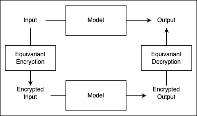

<div align="center">

<!-- Logo with light mode support -->
<picture>
  <source media="(prefers-color-scheme: light)" srcset="docs/nesa-logo-light.png">
  
</picture>
<br>
<br>
<p>
Nesa: Run AI models end-to-end encrypted.
</p>

<h3 style="margin-top: 15px; margin-bottom: 15px; display: flex; justify-content: center; align-items: center; gap: 15px;">
  <a href="https://discord.gg/TK89MgJDkz" style="text-decoration: none;">
    </a>
  <a href="https://x.com/nesaorg/" style="text-decoration: none;">
    
  </a>
</h3>

<!-- GitHub Repo Stats -->
[](https://github.com/nesaorg/Equivariant-Encryption-for-AI/stargazers)
[](https://github.com/nesaorg/Equivariant-Encryption-for-AI/network/members)
[](https://github.com/nesaorg)
</div>

<!---
---
-->

Forget multi-million dollar on-prem infrastructure for AI, get the same privacy guarantees in an API: run AI like the biggest enterprises do.

## Features ##

<table border="0">
 <tr>
    <td><b style="font-size:30px">Full Privacy</b></td>
    <td>nesa serves AI with zero visibility on underlying data and full blindness on query</b></td>
 </tr>
 <tr>
    <td><b style="font-size:30px">Speedy </td>
    <td>nesa delivers no latency on encrypted inference (<0.1% original execution time)</td>
 </tr>
<tr>
    <td><b style="font-size:30px">Wide Model Coverage</b></td>
    <td>nesa supports encrypting Llama, Mistral, Stable Diffusion and thousands of models</td>

 </tr>
 <tr>
    <td><b style="font-size:30px">Cost Savings</b></td>
    <td>nesa can deliver significant cost savings as an API vs. on-prem AI infrastructure</td>
 </tr>
<tr>
    <td><b style="font-size:30px">ChatGPT Compatible</b></td>
    <td>nesa has a ChatGPT-compatible API for running encrypted AI with a one line change</td>
 </tr>
 <tr>
    <td><b style="font-size:30px">Quick Set-up</b></td>
    <td>nesa is one click to install and go. See documentation</td>
 </tr>
</table>

## How Nesa Achieves Blind AI: Equivariant Encryption (EE) ##

At Nesa, privacy is a critical objective. On our path toward universal private AI, we confronted a key challenge: **how can we perform inference on neural networks without exposing the underlying input and output data to external parties, while returning requests without high latency?** Traditional approaches, such as differential privacy, ZKML or homomorphic encryption (HE), while conceptually strong, fall short in practical deployments for complex neural architectures. These methods struggle to handle non-linear operations efficiently, often imposing substantial computational overhead that makes them infeasible to integrate into real-time or large-scale systems.

Equivariant Encryption (EE) is a new security technology by Nesa, similar to Homomorphic Encryption (HE) in arithmetic-based privacy-preserving structure, but executed inside unique discrete architectures designed to provide complete inference encryption without additional latency.

The result is the first portable on-prem AI infrastructure solution inside of an API. Your cloud provider cannot see your data and queries with Nesa.

## Equivariant Encryption (EE) vs. Homomorphic Encryption (HE)

A snapshot of Equivariant Encryption's properties versus homomorphic encryption:

| **Feature** | **Equivariant Encryption (EE)** | **Homomorphic Encryption (HE)** |
| --- | --- | --- |
| Latency Overhead | Zero | Very High |
| Non-Linear Operations | Exact | Approximation Needed  |
| User Key Control | Direct & Custom | Schema-Defined  |
| Cryptographic Hardness | Massive Combinatorial Complexity | Standard Hardness Assumptions |

**Zero overhead:** Nesa's EE provides the same latency as plaintext inference, with no slowdowns.

**100k+ factorial:** Nesa's EE has a massive combinatorial complexity, contributing to the strongest security guarantees.

## Our Journey to Equivariant Encryption

We have implemented and investigated numerous methodologies that promise end-to-end data privacy. We began with deep orchestration work in **Trusted Execution Environments (TEE)** which is a hardware solution that decrypts, transforms, and re-encrypts data in secure memory. The issue with TEEs, besides cost and access, is that they still provide full back-door administrator access to your data, which for many enterprises and use cases is insufficient. **Differential privacy** seeks to obscure sensitive details by adding statistical noise, but it cannot fully prevent inference on raw data once it is processed by a model. **Homomorphic encryption**, on the other hand, is mathematically elegant: it permits computations directly on encrypted data. This is achieved through operations that are homomorphic to addition and multiplication, enabling algebraic manipulation of ciphertexts that, once decrypted, yield the correct plaintext results. Such a property is exceptionally appealing in scenarios like outsourced cloud computations, where one can perform inference off-site without revealing the sensitive inputs.

However, standard HE schemes are tailored around arithmetic operations. Neural networks, especially those with layers like attention mechanisms, activation functions, or normalization steps, do not map cleanly onto ring or field operations alone. Adapting HE to these complex transformations typically incurs prohibitive computational costs, slowing inference to impractical speeds.

Despite this, the conceptual promise of HE—running inference on encrypted data without decryption—prompted us to seek an alternative. We aimed to preserve the protective qualities of encrypted computation while working around the bottlenecks introduced by non-linear neural functions.

## Equivariant Encryption for Neural Networks

Our solution is **Equivariant Encryption (EE)**. The term **equivariance** signifies a change in representation that preserves the operational structure from the model’s perspective. In other words, we transform the input data into an encrypted domain where the neural network’s computations can be carried out as though it were processing plaintext, all while maintaining the secrecy of the underlying information.

<div align="center">
  
</div>

Rather than relying exclusively on arithmetic operations compatible with HE, EE integrates specialized transformations designed around the internal properties of neural networks. We exploit the known architecture, layer composition, and input-output mappings of the model to construct a system in which each step of inference operates correctly on encrypted inputs. This approach avoids expensive retraining on encrypted datasets. Instead, by following a set of mathematical guidelines, we can generate a new variant of the model that works with our encryption schema in a matter of seconds.

Formally, given some plaintext $p_i$, and some ciphertext $c_i$, with $p_i$ = decrypt($c_i$), our EE framework ensures that decrypt(nonlinear($c_1,c_2$)) = nonlinear($p_1,p_2$), where "nonlinear" represents a specific set of non-linear neural functions.

Crucially, the complexity of inference under EE does not surpass that of the unencrypted version. Each forward pass through the network involves approximately the same computational cost. Thus, **inference latency remains unchanged**, a significant advantage compared to conventional HE-based techniques.

To illustrate this with a tangible example, consider transformer-based models like ChatGPT, Claude, or Llama. These models employ tokenizers to convert text into discrete tokens, each mapped to an integer token ID. Under EE, we implement a specialized tokenizer that produces a different, encrypted set of token IDs. The network, now adapted to EE, treats these encrypted token IDs as standard inputs. It processes them identically to how it would process normal tokens, ultimately returning encrypted output tokens that can be decrypted locally by the user. The following diagram outlines this workflow:

<div align="center">
  
</div>

In this setup, all data traveling over the network remains encrypted, and the transformations that produce and consume these tokens are carefully chosen to deny any straightforward method for recovering the plaintext. The attacker sees only encrypted tokens and a model variant designed to operate on that encrypted space, providing no direct, low-cost avenue to extract the original information.

## In-Depth Comparison: HE vs. EE

Below is a more detailed breakdown of how Equivariant Encryption matches or outperforms the expectations we have from traditional Homomorphic Encryption methods:

| Property | Homomorphic Encryption (HE) | Equivariant Encryption (EE) |
| --- | --- | --- |
| **Data Confidentiality (Server Blindness)** | The server never sees the plaintext data. | The server never sees the plaintext data. |
| **Encrypted Computation** | Operations fully on encrypted data, with no intermediate decryptions. | EE models run directly on encrypted tokens, with no intermediate decryptions. |
| **User-Controlled Encryption** | Users should hold keys and control encryption/decryption. | Only the user can map plaintext to transformed tokens using EE tokenizer. |
| **Preservation of Accuracy** | The decrypted output should match the result of plaintext inference. | EE ensures final results are identical to plaintext inference outputs. |
| **Support for Arbitrary Model Structures** | HE struggles with non-linearities and complex NN layers. | EE is designed for modern neural architectures, preserving non-linearities. |
| **Minimal Performance Overhead** | HE incurs very large computational overhead. | EE imposes no overhead; inference latency matches that of plaintext data. |
| **No Approximation of Functions** | HE may require approximations of complex operations. | EE avoids approximations, preserving exact neural network functions. |
| **Scalability to Large Models** | Handling large models under HE is impractical. | EE scales naturally with large models without any computational penalties. |
| **Compatibility with Existing Pipelines** | HE often requires extensive pipeline modifications. | EE requires a one-time transformation, after which pipelines operate as normal. |
| **Clear Security Model & Robustness** | HE has very strong theoretical foundations. | EE provides a massively complex and secure combinatorial search space. |

## Attacks on EE Security

We have tested Equivariant Encryption with various baseline attack vectors, which can be found here: https://github.com/nesaorg/nesa/blob/main/Attack_Paper.pdf

### LLM-as-a-Judge Attack

Using a state-of-the-art large language model such as GPT-4o to evaluate whether the output P(Oi) is a good answer to the prompt P(Ii).

### Linguistic Domain Knowledge Attack

Using domain knowledge to design the loss function L, so that the loss L can capture the semantic meaning in the (decrypted) input, output and between.

### Brute-force Algorithm Attack

The most naive method is brute force, trying all possible permutations P and choosing the one with the minimal loss value. This algorithm requires time complexity of N!, which is infeasible.

### Random Sampling Attack

Randomly sampling M permutations and choosing the one with the lowest loss value. One can also try genetic algorithms to mix and cross-over multiple tries at different permutations.

### Hill-climbing Algorithm Attack

Starting with an arbitrary initial permutation P. The set of moves is the set of permutations that one can reach by transposing two elements of the permutation.

## Try EE for Yourself
Equivariant Encryption (EE) isn’t just a theoretical concept—it’s fully operational and ready to explore today! We’ve provided two demo models on Hugging Face so you can see, firsthand, how EE keeps data encrypted end-to-end while preserving the model’s functionality and accuracy.

Available Test Models:
- **[nesaorg/distilbert-sentiment-encrypted](https://huggingface.co/nesaorg/distilbert-sentiment-encrypted)**
  An encrypted version of DistilBert for sentiment classification. It demonstrates how text is encrypted before the model sees it, yet you still get accurate sentiment predictions on the decrypted output, 100% locally.

- **[nesaorg/Llama-3.2-1B-Instruct-Encrypted](https://huggingface.co/nesaorg/Llama-3.2-1B-Instruct-Encrypted)**
Encrypted version of a Llama-3.2-based model for interactive chat. This demo is half on Nesa's network, which is great for showing that only encrypted data is sent back and forth. The server doesn't have access to the tokenizer.

### Local Web UI
The quickest way to experience EE is to use the local web UI we provide.

Follow [demo/readme.md](demo/readme.md) to:
1. Run the platform-specific start script to install dependencies.
2. Wait for the local text-generation-WebUI to launch in your browser.
3. Enter your prompt.
4. Enjoy encrypted inference!

Under the hood, the text you type is turned into encrypted tokens, the model processes those tokens, and you see the final plaintext output only on your side. It’s a seamless experience with no extra overhead.

### Manual Python Usage

If you’d like to peek under the hood, below are quick examples demonstrating how to load the models directly from Hugging Face and run basic inferences.

##### Distillbert

```python
import torch

from transformers import  AutoModelForSequenceClassification, AutoTokenizer

# Initialize model and tokenizer
model_name  =  "nesaorg/distilbert-sentiment-encrypted"
model  =  AutoModelForSequenceClassification.from_pretrained(model_name)
tokenizer  =  AutoTokenizer.from_pretrained(model_name)
inputs  =  tokenizer("I feel much safer using the app now that two-factor authentication has been added", return_tensors="pt")

with torch.no_grad():
	logits  =  model(**inputs).logits
probs  = torch.nn.Softmax(dim=-1)(logits)[0].tolist()
class_scores  = {model.config.id2label[i]: prob  for  i, prob  in  enumerate(probs)}

sorted_class_scores  =  dict(sorted(class_scores.items(), key=lambda  item: item[1], reverse=True))
print("Class Scores:", sorted_class_scores)
```
##### nesaorg/Llama-3.2-1B-Instruct-Encrypted
Unlike DistilBert, this model’s weights reside on Nesa’s secure server, but the tokenizer is on Hugging Face. You can still use the tokenizer to encode and decode text and then submit it for inference via the Nesa network!

```python

###### Load the Tokenizer

from transformers import AutoTokenizer

hf_token = "<HF TOKEN>"  # Replace with your token
model_id = "nesaorg/Llama-3.2-1B-Instruct-Encrypted"
tokenizer = AutoTokenizer.from_pretrained(model_id, token=hf_token, local_files_only=True)
```

###### Tokenize and Decode Text

```python
text = "I'm super excited to join Nesa's Equivariant Encryption initiative!"

# Encode text into token IDs
token_ids = tokenizer.encode(text)
print("Token IDs:", token_ids)

# Decode token IDs back to text
decoded_text = tokenizer.decode(token_ids)
print("Decoded Text:", decoded_text)
```

###### Example Output:

```
Token IDs: [128000, 1495, 1135, 2544, 6705, 284, 2219, 11659, 17098, 22968, 8707, 2544, 3539, 285, 34479]
Decoded Text: I'm super excited to join Nesa's Equivariant Encryption initiative!
```

## The "Hack EE" Contest


&nbsp;
&nbsp;

We invite the community to examine and test the security claims of Equivariant Encryption. As part of our commitment to transparency and continual refinement, we have organized a competition encouraging participants to probe for weaknesses and demonstrate potential exploits.

For details, please visit:
[https://github.com/nesaorg/Equivariant-Encryption-for-AI/blob/main/CONTEST.md](https://github.com/nesaorg/Equivariant-Encryption-for-AI/blob/main/CONTEST.md)
